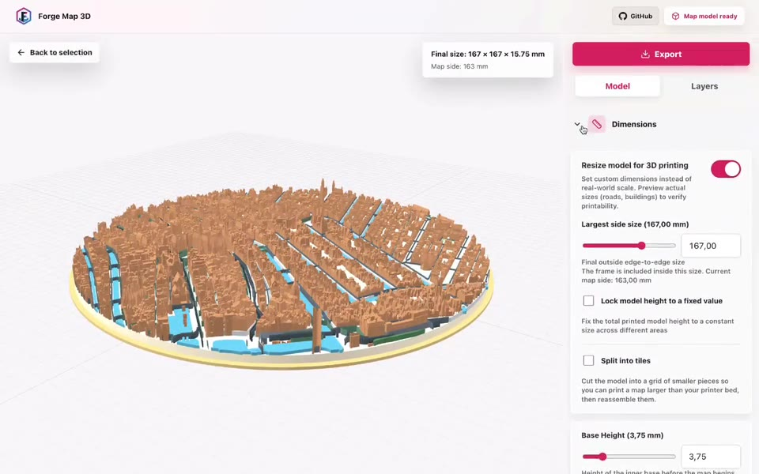

# Forge Map 3D

Forge Map 3D turns a real place into a customizable model for 3D printing.
It supports locations worldwide using OpenStreetMap for roads, water, and land
cover, Overture Maps for enriched building footprints, and detailed 3DBAG
building geometry in the Netherlands.

[Try it Online](https://forgemap3d.com)

> Forge Map 3D is pre-release software. Check generated geometry in your
> slicer before printing.

## What It Does

- Select a circular, square, or hexagonal area.
- Build roads, water, land cover, and buildings from real map data.
- Adjust model dimensions, colors, layer visibility, and printable heights.
- Preview the result interactively in 3D.
- Export a printable STL and a color OBJ/MTL archive.
- Use 3DBAG LoD2.2 building meshes for enhanced Dutch building detail.
- Use OpenStreetMap worldwide for roads, water, and land cover.
- Use Overture Maps for enriched worldwide building footprints where 3DBAG
  detail is unavailable.

## Preview

[](docs/assets/forge-map-3d-workflow.mp4)

Click the preview to watch the full workflow video.

## Requirements

- Node.js 22 or newer
- npm
- Internet access while using the editor, because map geometry and imagery are
  fetched from public upstream services

No API keys are required. `NOMINATIM_BASE_URL` can optionally point global
search at a self-hosted or third-party Nominatim-compatible service.
`OVERTURE_BUILDINGS_PM_TILES_URL` can optionally pin a specific Overture
buildings archive; otherwise the latest public release is discovered.

## Local Development

```bash
npm ci
npm run dev
```

Open [http://localhost:3000](http://localhost:3000).

Forge Map 3D accepts worldwide addresses, postcodes, place names, and
coordinates between approximately 85°S and 85°N. Locations outside the
Netherlands have a maximum selection radius of 2 km; Dutch locations can use
up to 5 km.

## Docker

Build and run the production app with Docker Compose:

```bash
docker compose up --build
```

Open [http://localhost:3000](http://localhost:3000).

To stop it:

```bash
docker compose down
```

## Checks

Run the complete offline release gate:

```bash
npm run check
```

This runs TypeScript checking, ESLint, geometry regression checks, and a
production build. The regression checks use local fixtures and do not call live
map services.

Individual commands are also available:

```bash
npm run typecheck
npm run lint
npm test
npm run build
```

## Data Sources

- [OpenStreetMap](https://www.openstreetmap.org/copyright) provides worldwide
  roads, waterways, land cover, map imagery, and source building data. Data is
  © OpenStreetMap contributors and available under the ODbL.
- [Overture Maps](https://docs.overturemaps.org/guides/buildings/) provides
  enriched worldwide building footprints assembled from OpenStreetMap and
  additional open sources.
- [3DBAG](https://docs.3dbag.nl/en/) provides enhanced Dutch building geometry
  by tudelft3d and 3DGI under CC BY 4.0.
- [Open Topo Data](https://www.opentopodata.org/datasets/srtm/) provides
  SRTM 30m elevation data through its public API. SRTM is supplied by USGS/NASA
  as public-domain elevation data.
- [Nominatim](https://nominatim.org/) provides worldwide place-name search.
- Public Overpass API instances provide OpenStreetMap geometry used for model
  generation.

Running a public instance does not transfer responsibility for upstream usage
policies. Review the
[OSM tile usage policy](https://operations.osmfoundation.org/policies/tiles/)
and the policies of every configured Overpass endpoint before launch. Keep
attribution visible in the application and with redistributed output where
required by the source licenses.

## Current Scope and Limitations

- 3DBAG building detail is available only for selections centered in the
  Netherlands.
- When 3DBAG building meshes are unavailable, building heights use Overture
  values where available and otherwise fall back to estimates.
- Selections crossing the international date line are not currently supported.
- Public data can be incomplete, outdated, or geometrically invalid.
- Upstream services can time out or rate-limit requests. Water fetch failures
  intentionally block export rather than silently producing an incorrect map.
- Detailed meshes may need repair in a slicer before printing.
- Place-name search uses OpenStreetMap Nominatim.
- Large areas can produce slow previews and large exports.

## Contributing

Contributions are welcome. Read [CONTRIBUTING.md](CONTRIBUTING.md) before
opening a pull request, and follow the
[Code of Conduct](CODE_OF_CONDUCT.md).

Security issues should be reported privately as described in
[SECURITY.md](SECURITY.md).

## License

Forge Map 3D is licensed under the
[GNU Affero General Public License v3.0 only](LICENSE).

If you modify the software and make that modified version available for people
to use over a network, the AGPL requires you to offer those users the
corresponding source code. This summary is not legal advice; the license text is
authoritative.
